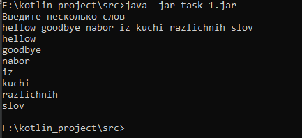
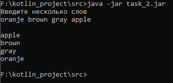
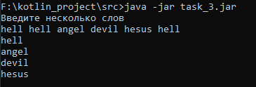
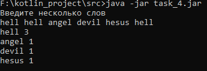
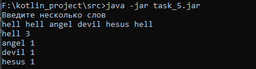
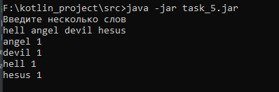

# kotlin_project
Задания запускаются по отдельности.

Для правильной работы программ потребуется JDK (Java Development Kit) (http://www.oracle.com/technetwork/java/javase/downloads/index.html) и компилятор языка kotlin (https://github.com/JetBrains/kotlin/releases/latest/).

Для запуска задания:\
1)Клонировать репозиторий\
2)Открыть директорию /src\
3)Ввести в консоль:\
c:\kotlinc\bin\kotlinc *TASK_NAME*.kt -include-runtime -d *TASK_NAME*.jar\
java -jar *TASK_NAME*.jar

Пример работы 1 задания (task_1):\
\
Суть задания - вывести получаемую строку в столбик

Пример работы 2 задания (task_2):\
\
В задании 2 получаемая строка выводится в столбик по алфавиту

Пример работы 3 задания (task_3):\
\
В задании 3 из получаемой строки выводятся уникальные слова

Пример работы 4 задания (task_4):\
\
В задании 4 выводится количество повторений слов

Пример работы 5 задания (task_5):\
\
В данном варианте выводятся слова по количеству повторений в убывающем порядке

В случае, если слова не повторяются, то есть уникальные, то происходит вывод по алфавиту:\
\
